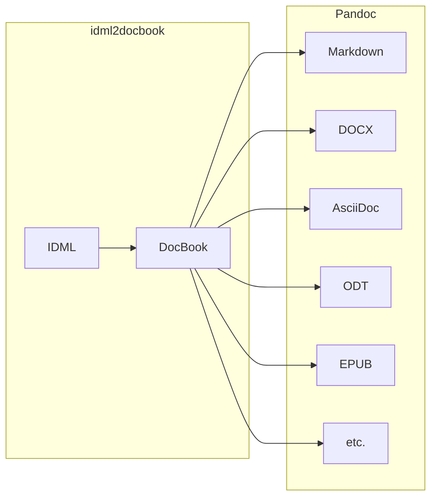

# idml2docbook

This Python package converts IDML (InDesign Markup Language) files to Docbook 5.1.

More importantly, because DocBook is supported by [Pandoc](https://pandoc.org/), this tool effectively enables IDML to be converted into dozens of other formats (Markdown, DOCX, EPUB, ODT, AsciiDoc, etc.).
In practice, idml2docbook acts as a [custom reader](https://pandoc.org/custom-readers.html) of IDML files for Pandoc. It is bridge between InDesign and the Pandoc ecosystem.



## Installation

First, [create a virtual environment](https://www.w3schools.com/python/python_virtualenv.asp).
Then, you can install and download this package using `pip`:

```
pip install idml2docbook
```

The package is now installed, but the environment still needs to be configured. This converter requires external dependencies because it is basically a wrapper around [idml2xml-frontend](https://github.com/transpect/idml2xml-frontend) that takes its [Hub XML](https://github.com/le-tex/Hub) output and converts it to Docbook 5.1. To make it all work, the following is required:

* python > 3.x
* java > 1.7
* bash > 5.x
* git (to install idml2xml-frontend)
* idml2xml-frontend

The following command helps you check if you have those dependencies installed. It also installs idml2xml-frontend and generates a sample `.env` if none are to be found in your folder:

```
idml2docbook-install-dependencies
```

**Note:** If you already have a `.env` file in your project, you will need to manually add it the path to idml2xml-frontend:

```
IDML2HUBXML_SCRIPT_FOLDER="/path/to/idml2xml-frontend"
```

## Usage

### Command-line

Convert an IDML file:

```bash
idml2docbook file.idml
```

Options are also available. They are as well documented in the command-line tool (see the help with `-h`/`--help`).

* **`-x`, `--idml2hubxml-file`** \
    Treats the input file as a Hub XML file. \
    Useful for saving processing time if `idml2xml-frontend` has already been run on the source IDML file.

* **`-o`, `--output <file>`** \
    Name to assign to the output file. \
    By default, output is sent to standard output (stdout).

* **`-t`, `--typography`** \
    Applies French typographic refinements. \
    (thin spaces, non-breaking spaces, etc.).

* **`-l`, `--thin-spaces`** \
    Use only thin spaces for typography refinement. \
    Should be used together with `--typography`.

* **`-b`, `--linebreaks`** \
    Do not replace `<br>` tags with spaces.

* **`-f`, `--media <path>`** \
    Path to the folder containing media files. \
    Default: `Links`.

* **`-r`, `--raster <extension>`** \
    Extension to use when replacing that of raster images. \
    Example: `jpg`.

* **`-v`, `--vector <extension>`** \
    Extension to use when replacing that of vector images. \
    Example: `svg`.

* **`-i`, `--idml2hubxml-output <path>`** \
    Path to the output from Transpect’s idml2hubxml converter. \
    Default: `idml2hubxml`.

* **`-s`, `--idml2hubxml-script <path>`** \
    Path to the script of Transpect’s idml2xml-frontend converter.

* **`--version`** \
    Displays the version of idml2docbook and exits the program.

**Note:** For large IDML files, it may be necessary to [increase the Java heap size](https://github.com/transpect/idml2xml-frontend/blob/master/idml2xml.sh#L33), for example to `2048m` or `4096m`.

### IDML custom reader for Pandoc

Simple command to use this package with Pandoc:

```
pandoc -f docbook -t markdown <(idml2docbook input.idml)
```

Though, it is possible to do crazy stuff as well 🤪

```bash
pandoc -f docbook \
       -t markdown_phpextra \
       --wrap=none \
       -o output/output.md \
       <(python -m idml2docbook input.idml \
                --typography \
                --thin-spaces \
                --raster jpg \
                --vector svg \
                --media images)
```

The next release of Pandoc will add support for paragraph and character styles in the Docbook reader. In order to convert `role` attributes (paragraph and character styles data) into Pandoc classes, the [`roles-to-classes.lua`](https://github.com/yanntrividic/pandoc-roles-to-classes-filter) filter can be used:

```
pandoc -f docbook -t markdown --lua-filter=roles-to-classes.lua <(idml2docbook input.idml)
```

### Python script

Sample script to use the API:

```python
from idml2docbook.core import idml2docbook

file = "input.idml"

# Options are optional!
options = {
    'typography': True,
    'thin_spaces': True,
    'linebreaks': True,
    'ignore_overrides': True,
    'raster': "jpg",
    'vector': "svg",
    'media': "images"
}

output = idml2docbook(file, **options)
print(output)
```